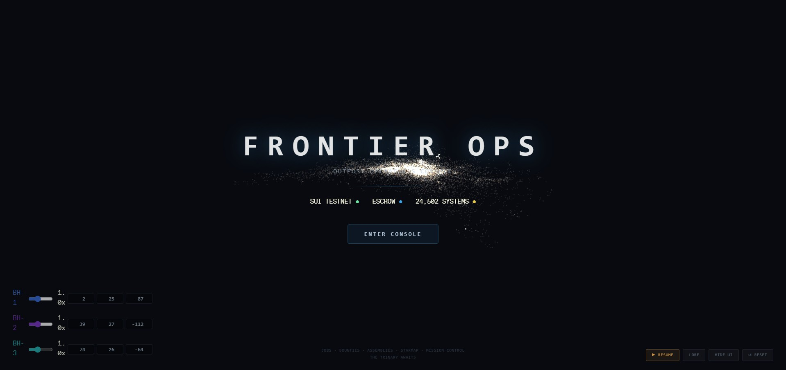
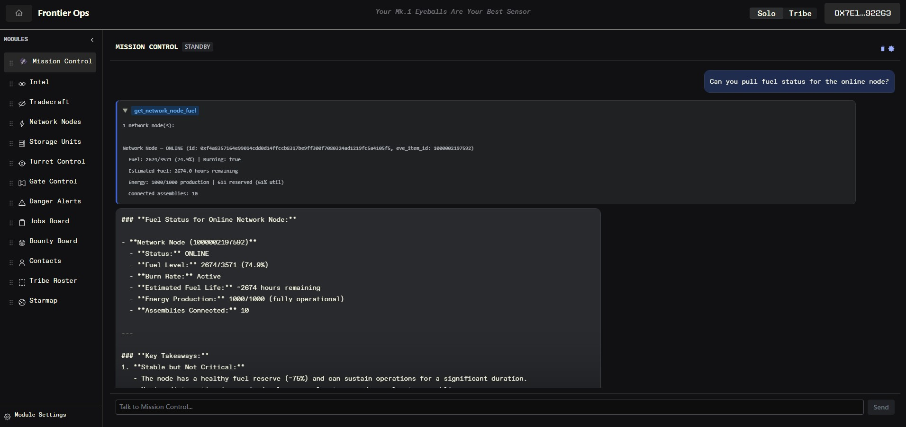
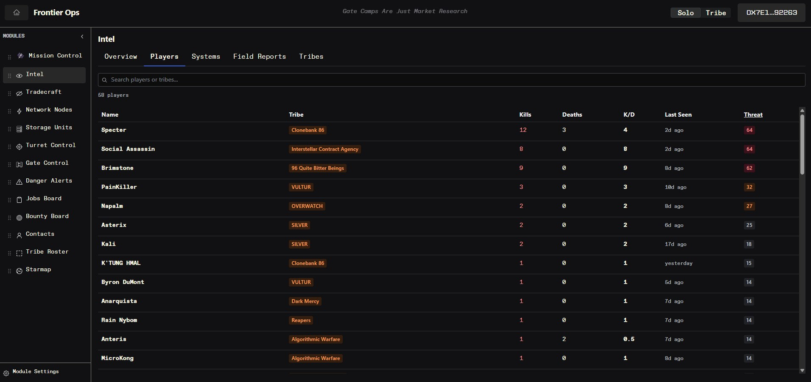
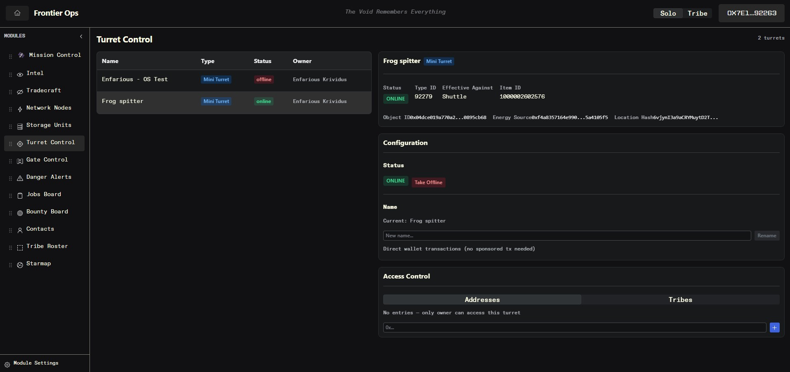
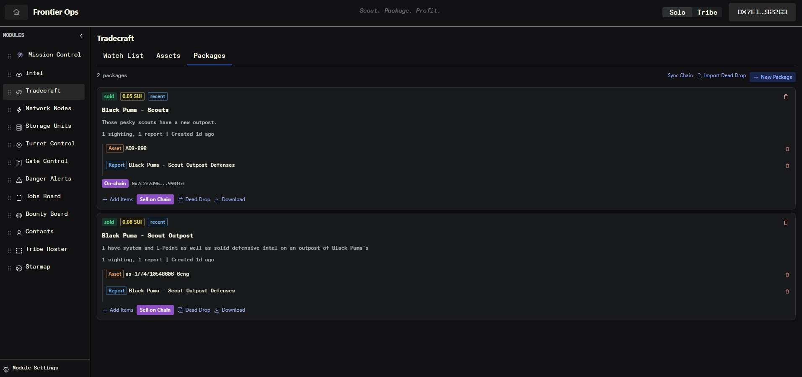
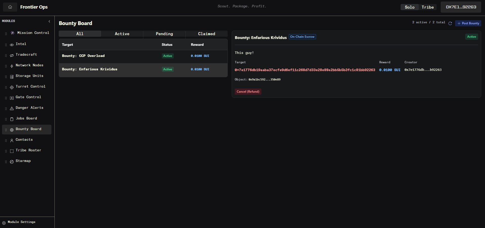

# FrontierOps

**An outpost operator's console for EVE Frontier.** Manage your smart assemblies, post jobs and bounties with SUI escrow, monitor threats, and let an AI agent run operations — all from your browser or the in-game panel.

🌐 **Live:** [enfarious.github.io/frontier-ops](https://enfarious.github.io/frontier-ops/)

## Screenshots

| Landing | Mission Control |
|---|---|
|  |  |

| Intel | Turret Control |
|---|---|
|  |  |

| Tradecraft | Bounty Board |
|---|---|
|  |  |

## What It Does

You're a solo operator running infrastructure in dangerous space. FrontierOps gives you:

- **Assembly Management** — Turrets, SSUs, gates, network nodes. Power on/off, rename, configure access rules, monitor fuel.
- **Jobs Board** — Post delivery jobs with SUI escrow. Assigned mode (one worker) or competitive race mode (first to deliver wins). Inventory verification against SSU contents.
- **Bounty Board** — Put a price on someone's head. SUI escrow, killmail auto-matching, claim/approve flow.
- **Danger Alerts** — Live killmail feed. See who's dying where, track threats near your assets.
- **Starmap** — 24,500+ solar systems rendered on canvas. Zoom, pan, see your infrastructure, gate connections, and kill activity.
- **Mission Control** — Chat with an AI agent that can query your assemblies, check threats, and execute on-chain actions with your approval.
- **Contacts & Tribe Roster** — Track friends, hostiles, and tribe members. Tribe data is read-only context, not a management tool.

Everything runs client-side. No backend. Jobs, bounties, and assembly actions are on-chain via Sui Move smart contracts. Personal data (contacts, settings) lives in your browser's local storage.

## For Humans: Getting Started

### Use the Live Site

Just go to [enfarious.github.io/frontier-ops](https://enfarious.github.io/frontier-ops/) and connect your Sui wallet. You'll see your assemblies and can start posting jobs/bounties immediately.

### In-Game Embedded View

Point a smart assembly's dApp URL at the live site with your assembly's object ID:

```
https://enfarious.github.io/frontier-ops/?itemId=YOUR_ASSEMBLY_ITEM_ID
```

The embedded view auto-detects the assembly type and shows relevant controls (SSU access rules, jobs board, turret config, etc.).

### Run Locally

```bash
git clone https://github.com/enfarious/frontier-ops.git
cd frontier-ops/dapps
cp .envsample .env        # Edit with your contract IDs (or use the defaults for testnet)
pnpm install
pnpm dev                  # → http://localhost:5173
```

### Connect Mission Control to an LLM

Mission Control works with any OpenAI-compatible API. In the app:

1. Click **Mission Control** in the sidebar
2. Click the **⚙ Settings** gear icon
3. Configure your endpoint:

| Provider | Endpoint | API Key |
|----------|----------|---------|
| **Ollama** (local) | `http://localhost:11434/v1` | (leave empty) |
| **LM Studio** (local) | `http://localhost:1234/v1` | (leave empty) |
| **OpenAI** | `https://api.openai.com/v1` | `sk-...` |
| **OpenRouter** | `https://openrouter.ai/api/v1` | `sk-or-...` |

4. Pick a model that supports tool calling (Qwen 3.5, Llama 3.1+, GPT-4, etc.)
5. Click **Test Connection** to verify

The LLM can query your assemblies, check fuel levels, look up threats, and execute on-chain actions (power, rename, access rules) — always with your confirmation before any transaction.

**Local dev note:** When running with `pnpm dev`, requests to `/llm-proxy` are automatically proxied to `http://localhost:11434` (Ollama default). On the deployed site, use the full endpoint URL in settings.

## For AI Agents: Architecture Overview

FrontierOps is designed to be operated by AI agents. The Mission Control module is a reference implementation, but the architecture supports any agent that can make HTTP requests and sign Sui transactions.

### On-Chain Data (Read)

All shared data lives on Sui testnet. Query via GraphQL:

```
Endpoint: https://graphql.testnet.sui.io/graphql
```

**Jobs** — `fetchOnChainJobs()` in `dapps/src/core/job-escrow-queries.ts`
- Queries all `Job` objects by type filter
- Returns: objectId, creator, worker, title, description, reward, status, competitive flag, contestants list

**Bounties** — `fetchOnChainBounties()` in `dapps/src/core/bounty-escrow-queries.ts`
- Queries all `Bounty` objects by type filter
- Returns: objectId, creator, hunter, title, target, proof, reward, status

**SSU Inventory** — `fetchSSUInventory()` in `dapps/src/core/inventory-data.ts`
- Reads dynamic fields on SSU objects
- Returns: item type IDs, quantities, volumes, max capacity

**World Data** — `dapps/src/core/world-api.ts`
- Solar systems, item types, tribes, constellations from `https://world-api-stillness.live.tech.evefrontier.com`
- Character search via cached character map

### On-Chain Actions (Write)

All write operations are Sui Programmable Transaction Blocks (PTBs). The builders are in:

- `dapps/src/core/job-escrow-actions.ts` — Create/accept/complete/approve/cancel jobs
- `dapps/src/core/bounty-escrow-actions.ts` — Create/claim/approve/reject/cancel bounties
- `dapps/src/core/assembly-actions.ts` — Rename, power on/off
- `dapps/src/core/ssu-access-actions.ts` — Set SSU deposit/withdraw rules

### Smart Contracts

| Contract | Package ID | Platform ID |
|----------|-----------|-------------|
| **Job Escrow** | `0x3be0da6286dbd68ed6dc2dec9c5fb65dd43764bb77705f0d9b4cdd0ce76d25df` | `0x4d8557e1963936480170ce69ede15f041635fd4d865be8c1bc86ac6b1b335997` |
| **Bounty Escrow** | `0xc641918fe45409dc54ebb7e2e3e22401f2a44361c3b16c3ad80ef1166f98751c` | `0x11cadbfe5cd5990c9568b0a2f56825994a372ff2dc911d6559612c61e6986d61` |

Both use the **AdminCap/Platform** pattern — the deployer gets an `AdminCap` that controls a shared `Platform` object holding the treasury address and fee rate. Fork and deploy your own to set your own fee recipient.

### Mission Control Tool Definitions

The LLM tool schema is in `dapps/src/modules/mission-control/tools.ts`. Available tools:

| Tool | Type | Description |
|------|------|-------------|
| `list_assemblies` | Query | List all owned assemblies with status |
| `get_assembly_details` | Query | Detailed info on one assembly |
| `get_network_node_fuel` | Query | Fuel levels, burn rates, energy production |
| `get_danger_alerts` | Query | Recent killmails and threat data |
| `lookup_solar_system` | Query | System coordinates and gate connections |
| `get_contacts` | Query | Contact list with standings |
| `get_roles` | Query | Custom roles and assignments |
| `set_power` | Action | Bring assembly online/offline (needs confirmation) |
| `rename_assembly` | Action | Rename an assembly (needs confirmation) |
| `set_ssu_access` | Action | Set SSU deposit/withdraw rules (needs confirmation) |

The tool executor (`tool-executor.ts`) handles data queries immediately and returns `PendingAction` objects for on-chain operations that need user confirmation.

## Fork & Deploy Your Own

This project is designed to be given away. To run your own instance:

1. **Deploy contracts** — `cd move-contracts/job_escrow && sui client publish` (and same for `bounty_escrow`). You'll get your own Package ID, Platform ID, and AdminCap.

2. **Update .env** — Set your new package and platform IDs.

3. **Deploy the frontend** — Push to GitHub, enable Pages, or deploy to Vercel/Netlify/Cloudflare Pages. The GitHub Actions workflow at `.github/workflows/deploy-pages.yml` handles it automatically.

4. **Set your fees** — Use your AdminCap to call `set_treasury` and `set_fee_bps` on the Platform object.

## Tech Stack

- **Frontend:** React 19 + Vite + Radix UI Themes
- **Chain:** Sui (testnet) via `@mysten/sui` SDK
- **Contracts:** Sui Move (`move-contracts/`)
- **Wallet:** `@mysten/dapp-kit-react` (supports all Sui wallets)
- **Storage:** localStorage for personal data, on-chain for shared data
- **LLM:** Any OpenAI-compatible API (local or cloud)
- **Deployment:** GitHub Pages (static site, zero backend)

## License

MIT — see [LICENSE](./LICENSE).
